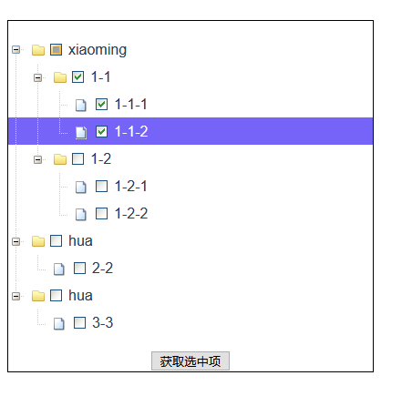

# v-tree

npm install vue-tree-jf --save

```
import vueTree from 'vue-tree-jf'

Vue.use(vueTree);


.....
<vue-tree  :treeData='datas' ref='vtree' @clickNode ='clickNode' ></vue-tree>

```
### 初始化参数
<table>
  <tr>
    <td>参数</td>
    <td>类型</td>
     <td>默认值</td>
    <td>描述</td>
  </tr> 
    <tr>
    <td>treeData</td>
    <td>Array</td>
     <td></td>
    <td>数据源，包含'id','text','icon','children'属性。<br/>示例：[
        {text:'xiaoming',
          id:'1',
          icon:'folder',
          children:[
              {text:'1-1',
                id:'1-1',
                icon:'folder',
                children:[
                  {text:'1-1-1',
                    id:'1-1-1',
                    icon:'file',
                  },{text:'1-1-2',
                    id:'1-1-2',
                    icon:'file'
                  }]
              },{
                text:'1-2',
                id:'1-2',
                icon:'folder',
              }]
        }
        ]</td>
  </tr>
   <tr>
    <td>checkBox</td>
    <td>Boolen</td>
     <td>false</td>
    <td>是否显示checkbox</td>
  </tr>
 </table>
 
### treeData参数
<table>
<tr>
  <td>参数名称</td>
  <td>类型</td>
  <td>默认值</td>
  <td>描述</td>
</tr>
<tr>
  <td>text</td>
  <td>String</td>
  <td></td>
  <td>节点名称</td>
</tr>
<tr>
  <td>id</td>
  <td>String</td>
  <td></td>
  <td>节点id</td>
</tr>
<tr>
  <td>icon</td>
  <td>String</td>
  <td></td>
  <td>节点图标</td>
</tr>
<tr>
  <td>children</td>
  <td>Array</td>
  <td></td>
  <td>节点的子节点</td>
</tr>
</table>

### 方法

 <table>
    <tr>
       <td>方法名称</td>
      <td>参数</td>
      <td>返回值</td>
      <td>描述</td>
    </tr>
   <tr>
       <td>getSelectedNode</td>
      <td>-</td>
      <td>返回选中的tree节点</td>
      <td></td>
    </tr>
    <tr>
       <td>getCheckedNodes</td>
      <td>-</td>
      <td>返回多选的tree节点</td>
      <td>在多选属性checkbox为true时有效。</td>
    </tr>
    <tr>
       <td>getRoot</td>
      <td>-</td>
      <td></td>
      <td>获取树根节点。</td>
    </tr>
    <tr>
       <td>findNode</td>
      <td>nodeId</td>
      <td>节点id</td>
      <td>获根据id获取选中节点数据。</td>
    </tr>
    <tr>
       <td>setSelectedNode</td>
      <td>node,ifClick</td>
      <td>node:节点数据，包含id字段即可。
ifClick：是否触发点击事件
</td>
      <td>设置树节点选中。</td>
    </tr>
    <tr>
       <td>getParentNode</td>
      <td>node</td>
      <td>node：节点对象（包含id属性即可）</td>
      <td>获取父节点数据。</td>
    </tr>
     <tr>
       <td>getParentNodesArr</td>
      <td>node</td>
      <td>node：节点对象（包含id属性即可）</td>
      <td>获取所有祖先节点数据数组。</td>
    </tr>
  </table>
  
### 事件说明

<table>
<tr>
<td>事件名称</td>
<td>参数</td>
<td>参数说明</td>
<td>描述</td>
</tr>
<tr>
<td>clickNode</td>
<td>node</td>
<td>当前点击节点的数据</td>
<td>节点点击时触发</td>
</tr>
</table>



### 使用示例
```
<template><div class="hello">
  <vue-tree :treeData='datas' ref='vtree' @clickNode='clickNode' :checkBox='checkbox'></vue-tree>
  <button @click='findSelected'>getNode</button></div>
</template>
<script>
  import Vue from 'vue'
  import vueTree from 'vue-tree-jf'
  Vue.use(vueTree);
  export default {
  name: 'HelloWorld',
  methods:{
      findSelected(){
          console.log('you clicked' + JSON.stringify(this.$refs.vtree.getSelectedNode()));
          if(this.checkbox){
               console.log('you choosed ' + JSON.stringify(this.$refs.vtree.getCheckedNodes()))
          }
      },
      clickNode(target){
        console.log('you clicked '+ target.id)
      }
  },
  data () {
    return {
      msg: 'Welcome to Your vtree App',
      checkbox:true,
      datas:[
        {text:'xiaoming',
          id:'1',
          icon:'folder',
          children:[
              {text:'1-1',
                id:'1-1',
                icon:'folder',
                children:[
                  {text:'1-1-1',
                    id:'1-1-1',
                    icon:'file',

                  },{text:'1-1-2',
                    id:'1-1-2',
                    icon:'file'

                  }]
              
              },{
                text:'1-2',
                id:'1-2',
                icon:'file',
              }]
        },
        {text:'hua',
          id:'2',
          icon:'folder',
          children:[{
            text:'2-2',
            id:'2-2',
            icon:'file',
          }]
        },
        {text:'hua',
          id:'3',
          icon:'folder',
          children:[{
            text:'3-3',
            id:'3-3',
            icon:'file',
          }]
        }
        ]
    }
  },
}
</script>
<style scoped>
.hello{
    float:left;
    width:400px;
    border:1px solid black;
}
</style>
```
